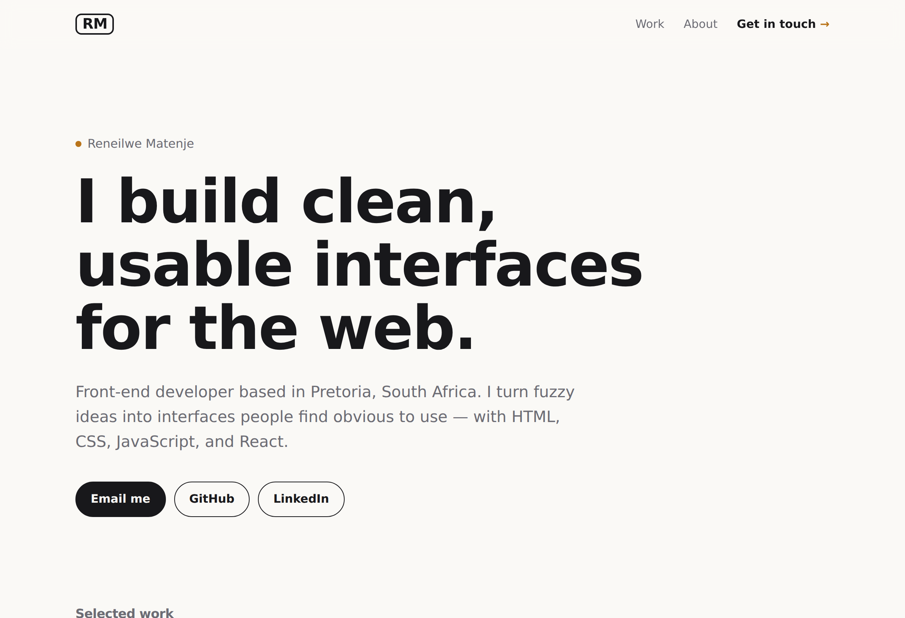

# Portfolio — Reneilwe Matenje

My personal portfolio landing page: a single place that introduces me and links to my projects (both the live sites and the code). Built from scratch with **vanilla HTML, CSS, and JavaScript**.



**Live demo:** _add your link after deploying_

## Before you deploy — fill in your links

Open `index.html` and search for **`EDIT:`** — every spot you need to change is marked with a comment. Here's the full checklist:

1. **Your email** — appears in three places (top nav, hero "Email me", footer). Replace `you@example.com`.
2. **Your GitHub profile** — hero + footer. Replace `https://github.com/your-username`.
3. **Your LinkedIn** — hero + footer. Replace `https://www.linkedin.com/in/your-profile` (or delete those two lines if you'd rather not link it).
4. **Each project's Live demo link** — four `href="#"` links. Paste the matching Vercel URL for each project.
5. **Each project's Code link** — replace `your-username` in the four `github.com/your-username/...` links.
6. **The About paragraphs** — reword them to sound like you. They're a starting point, not a script.

> Tip: until you paste real links, the "Live demo" buttons point to `#` (they just stay on the page) — so replace them before you share the site.

## Run locally

```bash
npx serve .
# or just open index.html
```

## Deploy

Same flow as the other projects: push this folder to its own GitHub repo (a good name is `portfolio`), then import it on Vercel. Framework preset is **Other** — no build step. This is the URL you'll put on your CV and LinkedIn.

## Structure

```
index.html      # all the content
styles.css      # the styling
app.js          # scroll-reveal + header divider (progressive enhancement)
assets/         # the four project screenshots
```

## Notes

- The page is fully readable **with JavaScript disabled** — the reveal animation is an enhancement layered on top, not a requirement for seeing the content.
- Responsive, keyboard-accessible, and respects `prefers-reduced-motion`.
- When you update a project's screenshot (e.g. a live capture of the weather app), replace the matching file in `assets/` and the card updates automatically.
